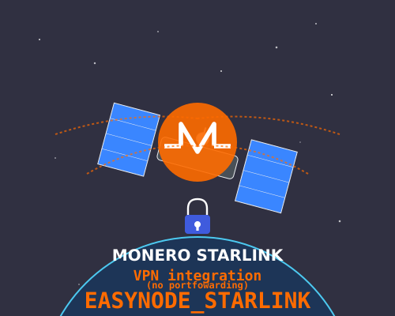
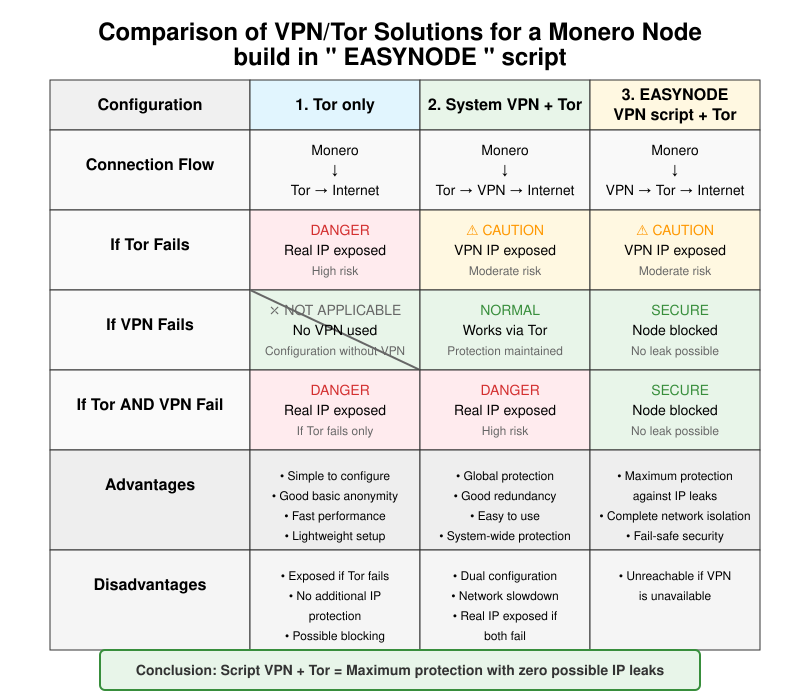

# 🔒 Easy Monero Node with VPN integration 
# Starlink Connections without port forwarding 🛰️🌐

##  ⚡Overview

This project offers a solution to the port forwarding issues encountered when running a Monero node on Starlink connections. 

Four approaches are provided:

1. **🔐 OpenVPN**: Creates an encrypted tunnel to an external VPN server, routing Monero traffic through this server which has open ports.

2. **🌍 ZeroTier**: Establishes a global peer-to-peer virtual network, bypassing NATs and firewalls without a central server, ideal for stable connections.

3. **⚙️ Monero with VPN Configuration**: Adapts Monero node parameters to work optimally on an already configured VPN interface. (eg: Mullvad_vpn)

4. **WIREGUARD**: Fast.

- Tor for secure RPC connections to your wallet, while using the VPN for blockchain P2P traffic.

- Your node's .onion addresses will remain accessible via Tor.

- Primary P2P traffic will go through the VPN if you configure Monero to use this interface.

  

## 🚀 Features

- 🔄 Automatic VPN interface detection
- 🛡️ Enhanced privacy through encrypted connections
- 🔌 No port forwarding required on your Starlink router
- 🤝 Better peer connectivity for your Monero node
- 🔒 Secured RPC connections
- 🔄 Stability during IP address changes

## DOWNLOAD

| Version | Links |
|---------|------|
| 🐧 Linux |  |

## 🛠️ Installation

Simply run " Easynode_starlink.sh " script and choose menu option for vpn.

## 🎯 Purpose

These solutions enable running a full Monero node behind Starlink without requiring port forwarding or third-party routers, using VPN technologies to establish reliable and secure incoming connections.

## 🔗 Compatibility

- ✅ Works with Starlink IPv4 and IPv6 connections
- ✅ Compatible with Monero CLI and GUI wallets
- ✅ Works with various VPN providers

##  Contributions

Feel free to submit issues or pull requests.
